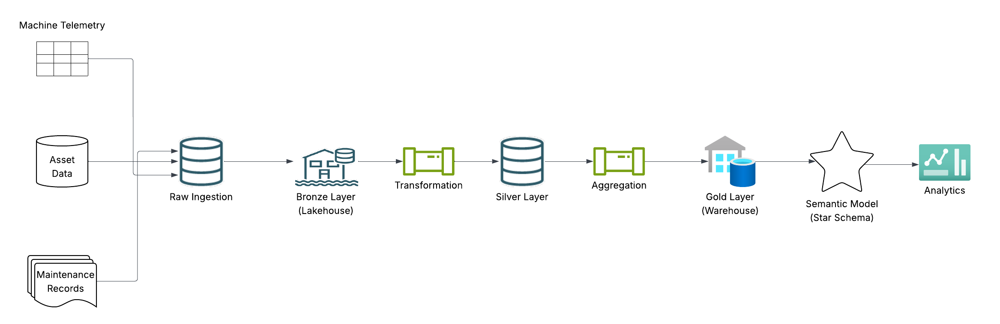

# Modern Data Engineering & Analytics Pipeline

This repository contains a hands-on, end-to-end data engineering and analytics practice pipeline, designed to simulate a modern Lakehouse architecture using **Databricks Community Edition**. The project spans data ingestion, transformation, real-time monitoring, and business intelligence visualization.

## Project Overview
The project is organized into three tiers, attempting to replicate a full data lifecycle:

1. **Data Engineering**
   - Ingest raw machine/telemetry data using Databricks notebooks.
   - Build Bronze → Silver → Gold tables with Delta Lake patterns.
   - Clean, validate, join, and aggregate data for analytics.

2. **Data Pipelines & Orchestration**
   - Simulate batch and pseudo-streaming pipelines in Databricks notebooks.
   - Orchestrate ingestion, transformation, and aggregation with failure handling and retries.
   - Document end-to-end pipeline flow.

4. **Analytics & Business Intelligence**
   - Design analytics-ready Gold layer using star schema.
   - Build key performance indicators (KPIs) for operational insight.
   - Visualize metrics with interactive Power BI dashboards.

## Architecture Flow
The following diagram shows the pipeline flow:

## Skills & Tools Practiced
- Databricks Community Edition notebooks
- Delta Lake / Lakehouse patterns
- Data ingestion and transformation
- Batch and streaming data processing
- Pipeline orchestration, failure handling, and logging
- Analytics modeling and KPI design
- Power BI dashboard creation
- Concepts related to Microsoft Fabric components (Lakehouse, Data Factory, Eventstream, Semantic Models)
